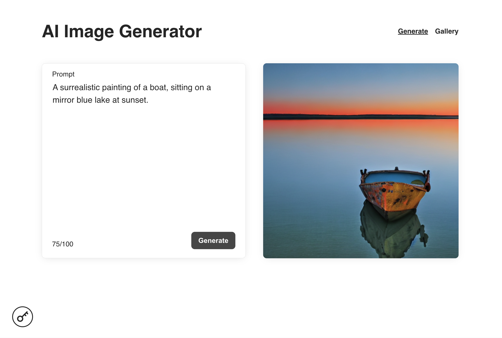

# Image Generator App

A simple image generator app built with Next.js, Redux, and WebSockets.

## Screenshot




## Hosted Version

A hosted version of this application is available at [stable-diffusion-image-gen.vercel.app](https://stable-diffusion-image-gen.vercel.app/).

### Extra Feature:

- **Public Gallery**: The hosted version includes a public gallery where users can view images generated by other users.

## Getting Started

### Installation

1. **Clone the repository:**

   ```bash
   git clone https://github.com/augustmarowski/image-generator-app.git
   cd image-generator-app
   ```

2. **Install dependencies:**

   ```bash
   pnpm install
   ```

3. **Run the development server:**

   ```bash
   pnpm dev
   ```

   The app will be available at `http://localhost:3000`.

4. **Build for production:**

   ```bash
   pnpm build
   pnpm start
   ```

## Technologies Used

- **Next.js**: Framework for server-rendered React applications.
- **TypeScript**: For type safety and enhanced development experience.
- **Redux Toolkit**: State management for the app.
- **WebSockets**: Real-time communication for image generation.

## Features

- **API Key Management**: Manage and store the API key required for image generation.
- **Image Generation**: Generate images based on text prompts in real-time using WebSockets.
- **Personal Gallery**: View and manage a gallery of generated images.
